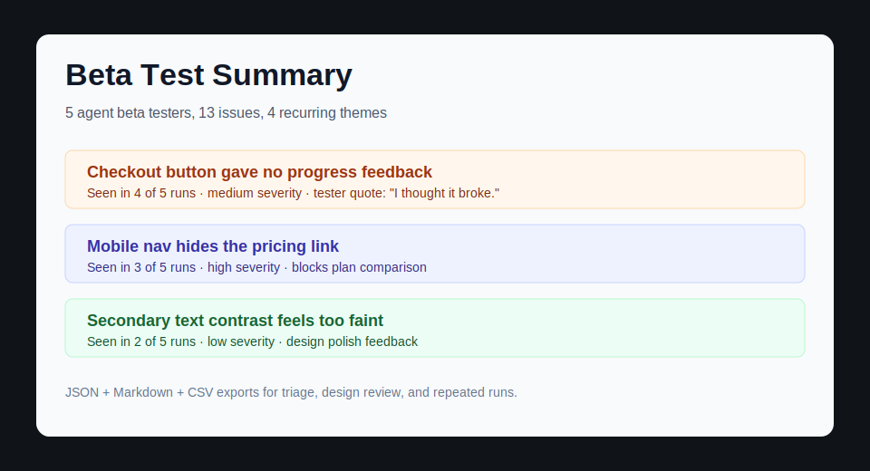

# Beta Test Skill

AI beta testers for your app before you launch.

`beta-test-skill` is a portable Agent Skill plus a small toolkit that helps Codex, Claude Code, and similar agents run realistic beta-test sessions against an app or website. It sends multiple believable tester personas through real product tasks, records what happened, validates structured reports, and aggregates the issues that keep showing up.



## Why This Exists

Most indie builders can get a code review faster than they can get five thoughtful people to try a product. This repo gives an agent a repeatable beta-testing protocol so it can act less like a synthetic checklist and more like a set of normal users: impatient, curious, sometimes confused, sensitive to visual polish, and good at noticing when something feels broken.

The goal is not to replace real users. The goal is to catch obvious launch-killers before you ask real users for their attention.

## What You Get

- A portable Agent Skill in `beta-test-app/` for Codex and Claude Code.
- A v2 JSON report schema for repeated beta-test runs.
- Standard-library Python scripts to validate run reports and aggregate repeated feedback.
- Example reports and summaries that show the intended output.
- Optional Playwright evidence runner for screenshots, console/network errors, and page timing data.
- A deliberately flawed demo app for testing the workflow locally.
- Eval prompts and CI checks for improving the skill over time.

## Install

### Codex

Copy or symlink the skill folder into your Codex skills directory:

```powershell
Copy-Item -Recurse .\beta-test-app "$env:USERPROFILE\.codex\skills\beta-test-app"
```

Then ask:

```text
Use $beta-test-app to beta test http://localhost:3000 with 5 independent testers.
```

### Claude Code

Copy or symlink the skill folder into your Claude skills directory:

```bash
cp -R beta-test-app ~/.claude/skills/beta-test-app
```

Then ask:

```text
/beta-test-app http://localhost:3000
```

Claude Code skills follow the open Agent Skills structure, so this repo intentionally keeps `SKILL.md` portable.

## 60-Second Demo

Run the intentionally flawed demo app:

```bash
cd demo/flawed-saas
python -m http.server 4173
```

In another terminal, ask your agent:

```text
Use $beta-test-app to beta test http://localhost:4173 with 3 independent testers. Use the optional evidence runner if helpful. Avoid purchases and destructive actions.
```

Expected output:

- `run-001.json`, `run-002.json`, etc.
- optional screenshots and evidence manifests
- `summary/summary.md`
- `summary/summary.json`
- `summary/summary.csv`

You can validate and aggregate reports yourself:

```bash
python beta-test-app/scripts/validate_report.py examples/reports/run-001.json
python beta-test-app/scripts/aggregate_reports.py examples/reports --output /tmp/beta-summary
```

## Example Output

```text
Top recurring issue: Checkout button gave no progress feedback
Seen in: 2 of 2 runs
Severity: medium
Tester reaction: "I would probably click twice or assume it broke."
Triage: Investigate after higher-severity blockers; observed repeatedly in checkout.
```

See `examples/reports/summary.md` for a full sample aggregate.

## Optional Playwright Evidence Runner

The skill does not require Playwright. The optional runner exists to make demos and evidence capture more credible:

```bash
cd runner
npm install
npx playwright install chromium
node evidence-runner.js capture --url http://localhost:4173 --out ../beta-test-results/demo --viewport 390x844 --label mobile
```

The runner writes screenshots, console/network observations, basic timings, and an evidence manifest. The agent still decides personas, tasks, and UX interpretation.

## Safety Model

The skill defaults to safe beta-testing behavior:

- Do not complete purchases or subscriptions.
- Do not message real users or publish public content.
- Do not delete or overwrite meaningful data.
- Do not use real personal information.
- Stop and ask before a risky action is needed to continue.

Reports can include evidence paths, visible UI text, console messages, and network failures, but they should not contain secrets or private data.

## Limitations

- Results are directional, not statistically rigorous, unless you run enough independent sessions.
- Agents can miss subtle product issues real users would catch.
- Subjective UX feedback should be validated with humans before major redesigns.
- The optional runner records evidence; it does not replace human-like agent judgment.

## Roadmap

- Better issue clustering with embeddings when available.
- HTML report export.
- Persona packs for common app categories.
- GitHub issue export from aggregate summaries.
- More eval fixtures and seeded demo defects.

## Contributing

Start with `CONTRIBUTING.md`. Good first contributions include new eval prompts, improved report examples, better demo app defects, and sharper aggregation heuristics.

